# **🏗️Building the silver layer**
### To build the silver layer, 2 steps are required: 
- Explore and understand the data
- Building the structure of the silver layer and Data Cleansing

## **Explore and understand the data**
#### It's crucial to understand the data at this point to be able to make decisions on what transformations it needs, as well as understand how the tables relate to each other
### I'll start by selecting 1000 rows from each table and analyze them:
Example:
```SQL
SELECT * FROM bronze.crm_cust_info LIMIT 1000;
```

### We can observe:

**crm_cust_info**
- Information about the customers
- "cst_id" and "cst_key" can be columns to establish a relationship with other tables

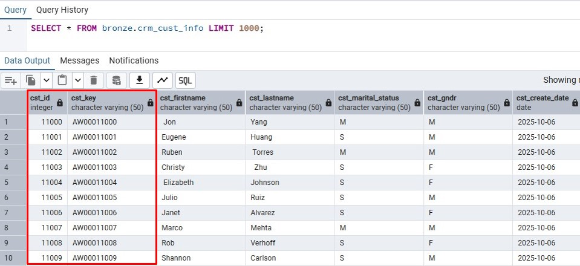

**crm_prd_info**
- Information about the products
- "prd_id" and "prd_key" can be columns to establish a relationship with other tables
- Some of the IDs have the same KEY and different costs. This signals that this table has information about the current and historical information of the products

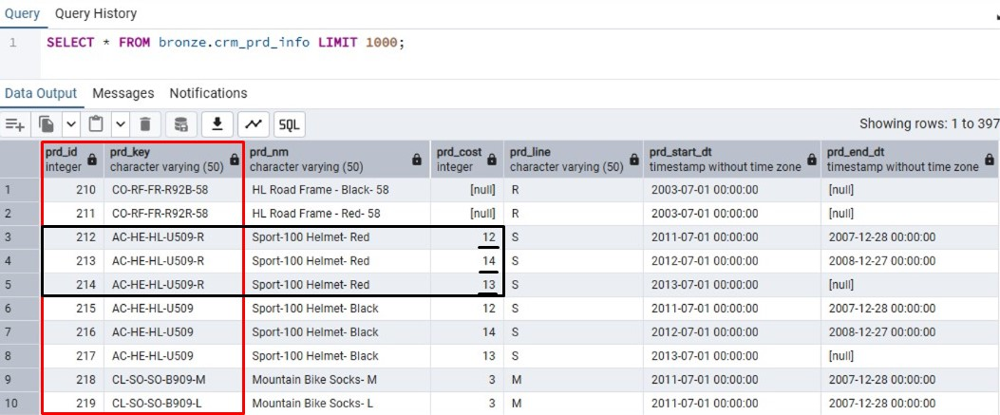

**crm_sales_details**
- Information about the sales
- "sls_prd_key" can be used to establish a relationship with crm_prd_info
- "sls_cust_id" can be used to establish a relationship with crm_cust_info
- Dates from orders, shipping and due times

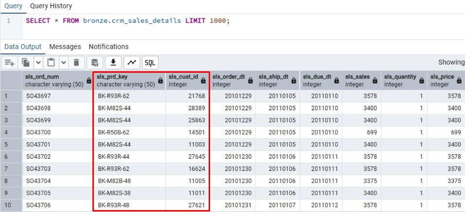

**erp_cust_az12**
- Birth dates of the customers
- "cid" column can be connected to the "cst_key" from the crm_cust_info table

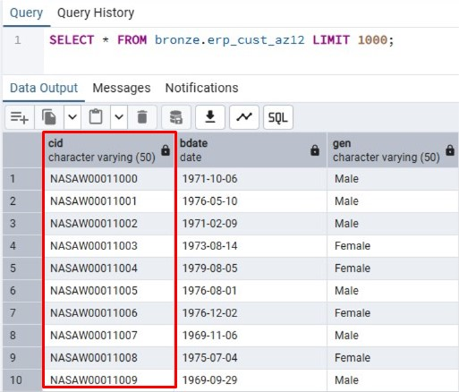

**erp_loc_a101**
- Additional information about the country of residency of the customers
- "cid" column can be connected to the "cst_key" from the crm_cust_info table

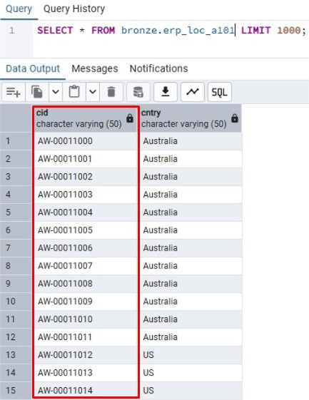

**erp_px_cat_g1v2**
- Information about product categories
- "id" column can be joined  with the "prd_key" column from crm_prd_info

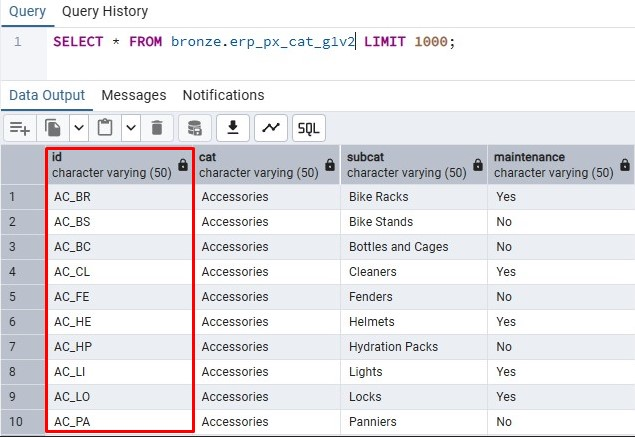

And here's a visual representation of the relationships between the tables:

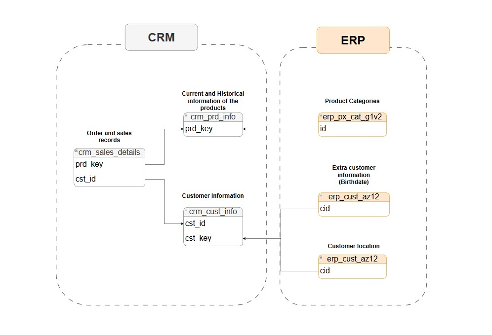

## **Building the structure of the silver layer and Data Cleansing**
As mentioned previously, the Silver layer will maintain most of the structure and names of the bronze layer, and additionally, a metadata column "dwh_create_date" to keep a record of the load's timestamp, therefore, to create the schema of the layer, I've used the following query:
```SQL
CREATE TABLE silver.crm_cust_info (
    cst_id             INT,
    cst_key            VARCHAR(50),
    cst_firstname      VARCHAR(50),
    cst_lastname       VARCHAR(50),
    cst_marital_status VARCHAR(50),
    cst_gndr           VARCHAR(50),
    cst_create_date    DATE,
    dwh_create_date    TIMESTAMP DEFAULT CURRENT_TIMESTAMP
);

CREATE TABLE silver.crm_prd_info (
    prd_id          INT,
    cat_id          VARCHAR(50),
    prd_key         VARCHAR(50),
    prd_nm          VARCHAR(50),
    prd_cost        INT,
    prd_line        VARCHAR(50),
    prd_start_dt    TIMESTAMP,
    prd_end_dt      TIMESTAMP,
    dwh_create_date TIMESTAMP DEFAULT CURRENT_TIMESTAMP
);

CREATE TABLE silver.crm_sales_details (
    sls_ord_num     VARCHAR(50),
    sls_prd_key     VARCHAR(50),
    sls_cust_id     INT,
    sls_order_dt    INT,
    sls_ship_dt     INT,
    sls_due_dt      INT,
    sls_sales       INT,
    sls_quantity    INT,
    sls_price       INT,
    dwh_create_date TIMESTAMP DEFAULT CURRENT_TIMESTAMP
);

CREATE TABLE silver.erp_loc_a101 (
    cid             VARCHAR(50),
    cntry           VARCHAR(50),
    dwh_create_date TIMESTAMP DEFAULT CURRENT_TIMESTAMP
);

CREATE TABLE silver.erp_cust_az12 (
    cid             VARCHAR(50),
    bdate           DATE,
    gen             VARCHAR(50),
    dwh_create_date TIMESTAMP DEFAULT CURRENT_TIMESTAMP
);

CREATE TABLE silver.erp_px_cat_g1v2 (
    id              VARCHAR(50),
    cat             VARCHAR(50),
    subcat          VARCHAR(50),
    maintenance     VARCHAR(50),
    dwh_create_date TIMESTAMP DEFAULT CURRENT_TIMESTAMP
);
```

Let's now analyze the data to see which transformations are needed.

### **crm_cust_info**
1. **Finding if there are ID duplicates:**
```SQL
SELECT cst_id, COUNT(*) 
FROM bronze.crm_cust_info
GROUP BY cst_id
HAVING COUNT(*) > 1 OR cst_id IS NULL;
```
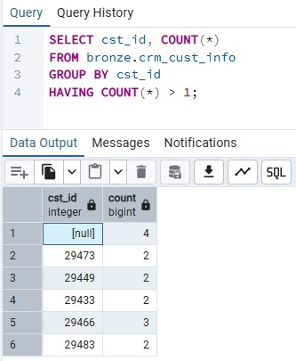

So it's confirmed that there are duplicates, which means that currently, the primary key is not unique or it's empty.

**To identify them:**

Starting by the id = 29466

```SQL
SELECT *
FROM bronze.crm_cust_info
WHERE cst_id = 29466;
```

This query results in the following:

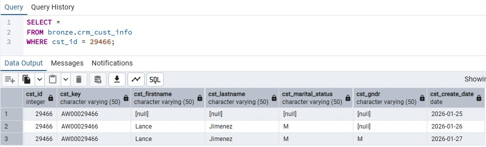

To decide which one to pick and which ones to remove, it's noticeable that one of them is more recent, which means it contains the latest data, so that's the one getting picked. For this, I'm using a query that orders each of the results by the creation date in descending order:

```SQL
SELECT *,
ROW_NUMBER() OVER(PARTITION BY cst_id ORDER BY cst_create_date DESC) AS flag_last
FROM bronze.crm_cust_info
WHERE cst_id = 29466;
```

And this is the result:

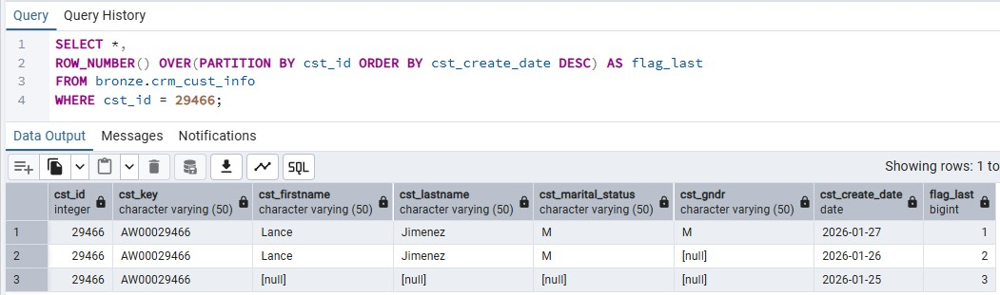

So now, by extracting the `WHERE cst_id = 29466`, and adding `WHERE flag_last = 1`, none of the duplicated rows will be shown.
```SQL
SELECT *
FROM (SELECT *,
ROW_NUMBER() OVER(PARTITION BY cst_id ORDER BY cst_create_date DESC) AS flag_last
FROM bronze.crm_cust_info)
WHERE flag_last = 1;
```

2. **Checking unwanted spaces on the columns "cst_firstname" and "cst_lastname"**

To find if there are rows with unwanted spaces, I'll query:

```SQL
SELECT cst_firstname, cst_lastname
FROM bronze.crm_cust_info
WHERE cst_firstname != TRIM(cst_firstname) OR cst_lastname != TRIM(cst_lastname);
```

The result is the following, with 29 rows with this issue:

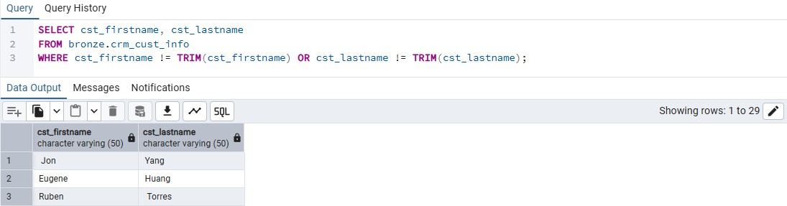

So to transform this:
```SQL
SELECT cst_id,
cst_key, 
TRIM(cst_firstname) as cst_firstname, 
TRIM(cst_lastname) as cst_lastname,
cst_marital_status,
cst_gndr,
cst_create_date
FROM (SELECT *,
ROW_NUMBER() OVER(PARTITION BY cst_id ORDER BY cst_create_date DESC) AS flag_last
FROM bronze.crm_cust_info
WHERE cst_id IS NOT NULL)
WHERE flag_last = 1;
```

3. **Checking data consistency on the columns "cst_gndr" and "cst_marital_status"**

Both of these columns have low cardinality, so to check the data consistency on these, I'll query cst_gndr first:
```SQL
SELECT DISTINCT (cst_gndr)
FROM bronze.crm_cust_info;
```
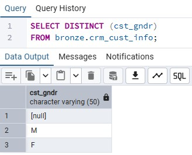

And from this result, it's observable that data is consistent, however, for better clarity, I'll transform the "M" into "Male" and F into "Female" for better clarity, adding this information to the previous query to keep building on it.

```SQL
SELECT 
    cst_id,
    cst_key, 
    TRIM(cst_firstname) AS cst_firstname, 
    TRIM(cst_lastname) AS cst_lastname,
    cst_marital_status,
    CASE 
        WHEN cst_gndr = 'F' THEN 'Female'
        WHEN cst_gndr = 'M' THEN 'Male'
        ELSE 'n/a'
    END AS cst_gndr,
    cst_create_date
FROM (
    SELECT *, ROW_NUMBER() OVER (PARTITION BY cst_id ORDER BY cst_create_date DESC) AS flag_last
    FROM bronze.crm_cust_info
    WHERE cst_id IS NOT NULL)
WHERE flag_last = 1;
```

And I'll apply the same process for the for the column "cst_marital_status"

```SQL
SELECT 
    cst_id,
    cst_key, 
    TRIM(cst_firstname) AS cst_firstname, 
    TRIM(cst_lastname) AS cst_lastname,
    CASE 
        WHEN cst_marital_status = 'S' THEN 'Single'
        WHEN cst_marital_status = 'M' THEN 'Married'
        ELSE 'n/a'
    END AS cst_marital_status,
    CASE 
        WHEN cst_gndr = 'F' THEN 'Female'
        WHEN cst_gndr = 'M' THEN 'Male'
        ELSE 'n/a'
    END AS cst_gndr,
    cst_create_date
FROM (
    SELECT *, ROW_NUMBER() OVER (PARTITION BY cst_id ORDER BY cst_create_date DESC) AS flag_last
    FROM bronze.crm_cust_info
    WHERE cst_id IS NOT NULL)
WHERE flag_last = 1;
```

And the results are clearer now:

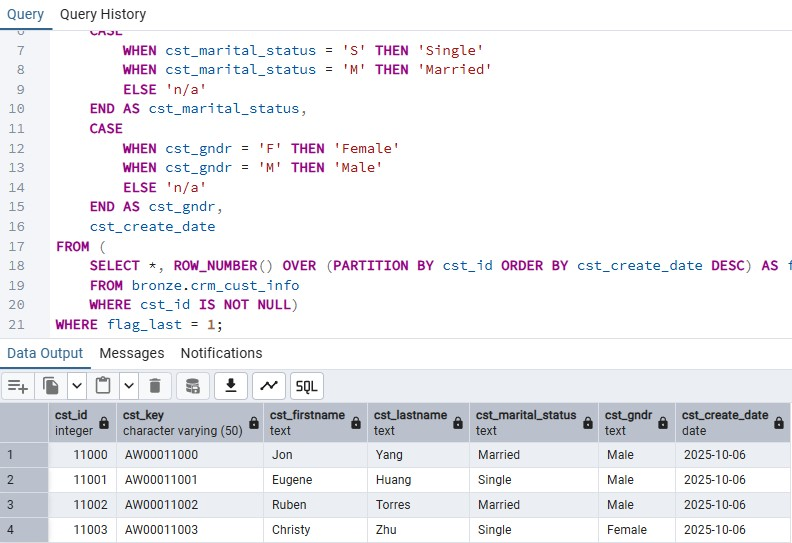

4. Inserting transformed data onto the silver layer
Now that the information needed is selected and the transformations are in place for this first table, I'll insert them onto the corresponding silver layer table with the following query:

```SQL
INSERT INTO silver.crm_cust_info (
    cst_id,
    cst_key,
    cst_firstname,
    cst_lastname,
    cst_marital_status,
    cst_gndr,
    cst_create_date
    )
SELECT 
    cst_id,
    cst_key, 
    TRIM(cst_firstname) AS cst_firstname, 
    TRIM(cst_lastname) AS cst_lastname,
    CASE 
        WHEN cst_marital_status = 'S' THEN 'Single'
        WHEN cst_marital_status = 'M' THEN 'Married'
        ELSE 'n/a'
    END AS cst_marital_status,
    CASE 
        WHEN cst_gndr = 'F' THEN 'Female'
        WHEN cst_gndr = 'M' THEN 'Male'
        ELSE 'n/a'
    END AS cst_gndr,
    cst_create_date
FROM (
    SELECT *, ROW_NUMBER() OVER (PARTITION BY cst_id ORDER BY cst_create_date DESC) AS flag_last
    FROM bronze.crm_cust_info
    WHERE cst_id IS NOT NULL)
WHERE flag_last = 1;
```

And here is how "silver.crm_cust_info" looks like:

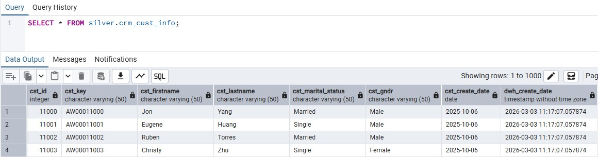

### **crm_prd_info**

1. Checking if "prd_id" have any duplicates
Just like the previous ID check, I'm trying to find if there are any duplicates or missing values of the primary key of this table using the following query:

```SQL
SELECT prd_id, COUNT(*) 
FROM bronze.crm_prd_info
GROUP BY prd_id
HAVING COUNT(*) > 1 OR prd_id IS NULL;
```

And none were found.

2. Extracting information from the "prd_key" column
This column has a lot of information, and, as seen before, it's possible to establish a relationship from this column to columns in other tables. 
For this, I'll be splitting it:
    - First 5 characters are the category ID present on the "erp_px_cat_g1v2" table, and additionally, replace the '-' with '_' for the columns to match
    - The rest of the character are the product key which can match with "sales details"

with the following query:

```SQL
SELECT
prd_id, 
REPLACE (SUBSTRING(prd_key, 1, 5), '-', '_') as cat_id,
SUBSTRING(prd_key, 7, LENGTH(prd_key)) as prd_key,
prd_nm,
prd_cost,
prd_line,
prd_start_dt,
prd_end_dt
FROM bronze.crm_prd_info
```

3. Checking unwanted spaces on the "prd_name"

To check unwanted spaces I'll used a query similar to the one used previously:

```SQL
SELECT prd_nm
FROM bronze.crm_prd_info
WHERE prd_nm != TRIM(prd_nm);
```

No results were found, which means everything is ok in this column

4. Checking the quality of the data in "prd_cost"

Checking for NULLS or negative numbers with this query:

```SQL
SELECT prd_cost
FROM bronze.crm_prd_info
WHERE prd_cost < 0 OR prd_cost IS NULL;
```

And the result shows that there are some NULL values:

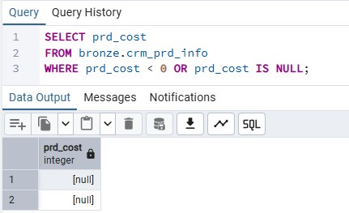

To make it cleaner, I'll transform these values into a 0 and keep on building on our syntax with the following query:

```SQL
SELECT
prd_id, 
REPLACE(SUBSTRING(prd_key FROM 1 FOR 5), '-', '_') AS cat_id,
SUBSTRING(prd_key, 7, LENGTH(prd_key)) AS prd_key,
prd_nm,
COALESCE(prd_cost, 0) AS prd_cost,
prd_line,
prd_start_dt,
prd_end_dt
FROM bronze.crm_prd_info;
```

And it's working as intended:

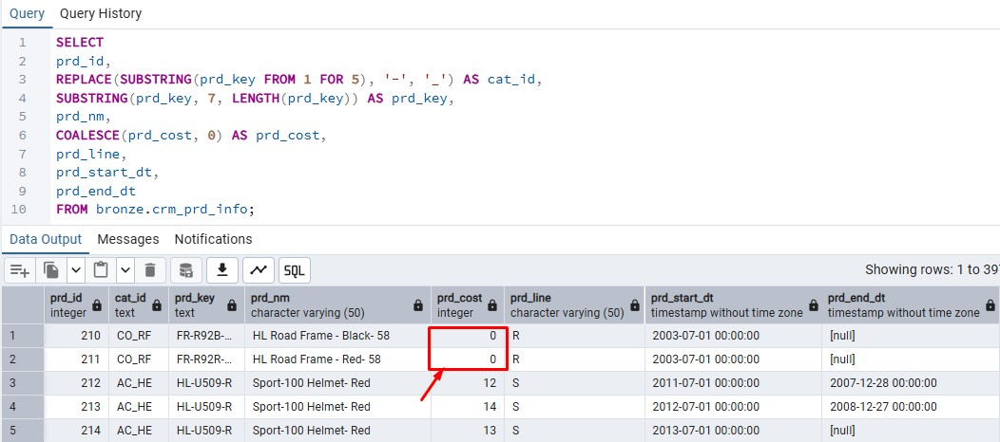

5. Checking the prd_line

Once again a low cardinality column, which can be checked with:

```SQL
SELECT DISTINCT prd_line
FROM bronze.crm_prd_info;
```

The data is consistent, but I'll once again make it clearer by subtituting the letters for their full meaning.
"M" for "Mountain", "R" for "Road", "S" for "other Sales" and "T" for "Touring" and keep on building on the query like this:

```SQL
SELECT
prd_id, 
REPLACE(SUBSTRING(prd_key FROM 1 FOR 5), '-', '_') AS cat_id,
SUBSTRING(prd_key, 7, LENGTH(prd_key)) AS prd_key,
prd_nm,
COALESCE(prd_cost, 0) AS prd_cost,
CASE WHEN TRIM(prd_line) = 'M' THEN 'Mountain'
	WHEN TRIM(prd_line) = 'R' THEN 'Road'
	WHEN TRIM(prd_line) = 'S' THEN 'other Sales'
	WHEN TRIM(prd_line) = 'T' THEN 'Touring'
	ELSE 'n/a'
	END AS prd_line,
prd_start_dt,
prd_end_dt
FROM bronze.crm_prd_info;
```

And it's working as intended:

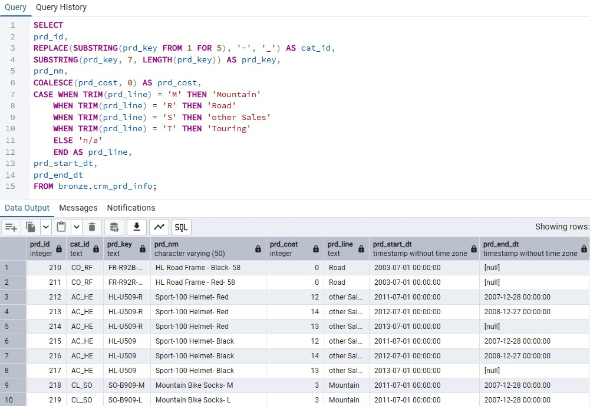

6. Checking the quality of start and end date columns

Starting by seeing whether there are any columns where the end date is earlier than the start date.
And the following is immediatly clear:

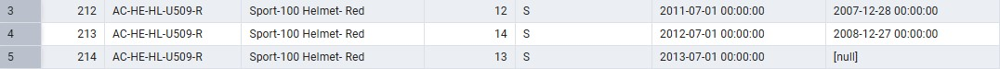

There are not only columns where the end date is later than the start date, but also, there are columns where dates overlap, and rows where the start date is NULL,  meaning that there is an inconsistency with the quality of these records. To fix this:

```SQL
CAST (prd_start_dt AS DATE) AS prd_start_dt,
CAST (LEAD(prd_start_dt) OVER (PARTITION BY prd_key ORDER BY prd_start_dt)-INTERVAL '1 day' AS DATE) AS prd_end_dt
```

This query does the following:
- Converts the TIMESTAMP into DATE 
- Looks at when the next version starts, subtracts one day, and use that as this version’s end date

And adding this the query previously built:

```SQL
SELECT
prd_id, 
REPLACE(SUBSTRING(prd_key FROM 1 FOR 5), '-', '_') AS cat_id,
SUBSTRING(prd_key, 7, LENGTH(prd_key)) AS prd_key,
prd_nm,
COALESCE(prd_cost, 0) AS prd_cost,
CASE WHEN TRIM(prd_line) = 'M' THEN 'Mountain'
	WHEN TRIM(prd_line) = 'R' THEN 'Road'
	WHEN TRIM(prd_line) = 'S' THEN 'other Sales'
	WHEN TRIM(prd_line) = 'T' THEN 'Touring'
	ELSE 'n/a'
	END AS prd_line,
CAST (prd_start_dt AS DATE) AS prd_start_dt,
CAST (LEAD(prd_start_dt) OVER (PARTITION BY prd_key ORDER BY prd_start_dt)-INTERVAL '1 day' AS DATE) AS prd_end_dt
FROM bronze.crm_prd_info;
```

At this point, the data type of 2 columns were changed, so I'll change the DDL of the silver layer like this:

```SQL
ALTER TABLE silver.crm_prd_info
ALTER COLUMN prd_start_dt TYPE DATE,
ALTER COLUMN prd_end_dt TYPE DATE;
```

And now we can insert the data onto the silver layer table "crm_prd_info" like this:

```SQL
INSERT INTO silver.crm_prd_info(
	prd_id,
	cat_id,
	prd_key,
	prd_nm,
	prd_cost,
	prd_line,
	prd_start_dt,
	prd_end_dt
)
SELECT
prd_id, 
REPLACE(SUBSTRING(prd_key FROM 1 FOR 5), '-', '_') AS cat_id,
SUBSTRING(prd_key, 7, LENGTH(prd_key)) AS prd_key,
prd_nm,
COALESCE(prd_cost, 0) AS prd_cost,
CASE WHEN TRIM(prd_line) = 'M' THEN 'Mountain'
	WHEN TRIM(prd_line) = 'R' THEN 'Road'
	WHEN TRIM(prd_line) = 'S' THEN 'other Sales'
	WHEN TRIM(prd_line) = 'T' THEN 'Touring'
	ELSE 'n/a'
	END AS prd_line,
CAST (prd_start_dt AS DATE) AS prd_start_dt,
CAST (LEAD(prd_start_dt) OVER (PARTITION BY prd_key ORDER BY prd_start_dt)-INTERVAL '1 day' AS DATE) AS prd_end_dt
FROM bronze.crm_prd_info;
```

### **crm_sales_details**

1. Checking for issues in "sls_order_num"

Checking for spaces with the following query:

```SQL
SELECT *
FROM bronze.crm_sales_details
WHERE sls_ord_num != TRIM(sls_ord_num);
```

No results were found, which means this column doesn't need any transformation

2. Checking for issues in "sls_prd_key" and "sls_cust_id"

```SQL
SELECT * 
FROM bronze.crm_sales_details
WHERE sls_prd_key NOT IN (SELECT prd_key FROM silver.crm_prd_info);
```

No results were found, so for everything is still problemless.

```SQL
SELECT * 
FROM bronze.crm_sales_details
WHERE sls_cust_id NOT IN (SELECT cst_id FROM silver.crm_cust_info);
```

And this one also has no problems, which means that the columns are properly set to be connected in the future.

3. Cheking the dates columns

In these columns, it's immediatly visible that the dates are in type INTEGER, which means they need to be transformed in DATE.

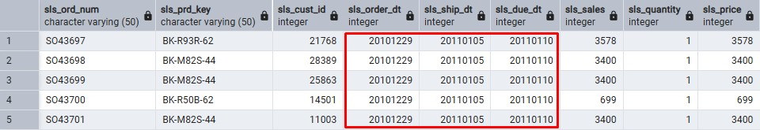

And I can also check if there are dates that are "0" or negative

```SQL
SELECT
sls_order_dt,
sls_ship_dt,
sls_due_dt
FROM bronze.crm_sales_details
WHERE sls_order_dt <= 0 OR sls_ship_dt <= 0 OR sls_due_dt <= 0;
```

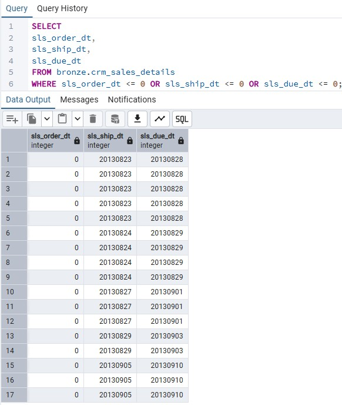

And there are, which means this also needs to be addressed.

Can also check whether there are numbers that differ 8 algorithms, which would mean an invalid date. (Typecasting onto char so the LENGTH function works)

```SQL
SELECT
    sls_order_dt,
    sls_ship_dt,
    sls_due_dt
FROM bronze.crm_sales_details
WHERE LENGTH(sls_order_dt::text) != 8
   OR LENGTH(sls_ship_dt::text) != 8
   OR LENGTH(sls_due_dt::text) != 8;
```

And there are rows that differ from 8 algorithms.

Lastly, it's also important to check whether the dates are in correct order (if order date is earlier than ship date, and if ship date is earlier than due date) with this query:

```SQL
SELECT * 
FROM bronze.crm_sales_details
WHERE sls_order_dt > sls_ship_dt OR sls_ship_dt > sls_due_dt;
```

No results were found, so everything is okay for this one.

To address all of the previous issues, I'll query:

```SQL
SELECT
    sls_ord_num,
    sls_prd_key,
    sls_cust_id,
    CASE WHEN sls_order_dt = 0 OR LENGTH(CAST(sls_order_dt AS VARCHAR)) != 8 THEN NULL
        ELSE TO_DATE(CAST(sls_order_dt AS VARCHAR), 'YYYYMMDD')
    END AS sls_order_dt,
    CASE WHEN sls_ship_dt = 0 OR LENGTH(CAST(sls_ship_dt AS VARCHAR)) != 8 THEN NULL
        ELSE TO_DATE(CAST(sls_ship_dt AS VARCHAR), 'YYYYMMDD')
    END AS sls_ship_dt,
    CASE WHEN sls_due_dt = 0 OR LENGTH(CAST(sls_due_dt AS VARCHAR)) != 8 THEN NULL
        ELSE TO_DATE(CAST(sls_due_dt AS VARCHAR), 'YYYYMMDD')
    END AS sls_due_dt,
	sls_sales,
    sls_quantity,
    sls_price
FROM bronze.crm_sales_details;
```

4. Checking if Sales = quantity * price
It's important to ensure that no values are negative nor NULL. for this:

```SQL
SELECT 
sls_sales,
sls_quantity,
sls_price
FROM bronze.crm_sales_details
WHERE sls_sales != sls_quantity * sls_price
OR sls_sales IS NULL OR sls_quantity IS NULL OR sls_price IS NULL
OR sls_sales <= 0 OR sls_quantity <= 0 OR sls_price <= 0
ORDER BY sls_sales, sls_quantity, sls_price;
```

And this is the result:

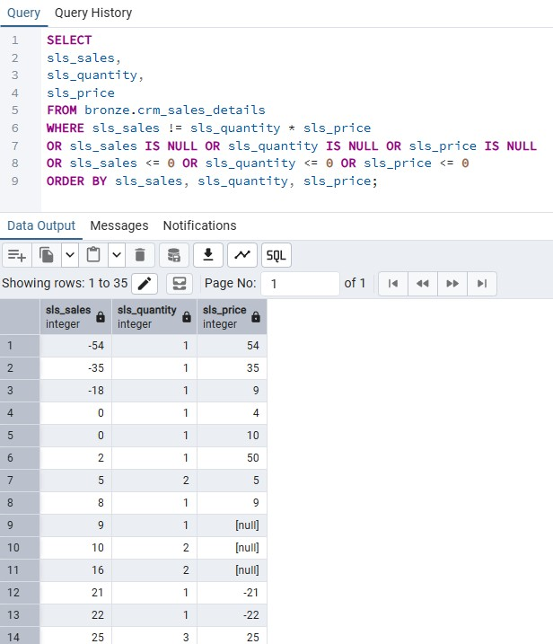

And from this, many issues are visible:
- Negative numbers and 0s
- Wrong calculations
- so sales values have NULLS

To fix these I'll follow these principles:
- If sales are negative, 0 or NULL, derive them from the QUANTITY and PRICE
- If PRICE is 0 or NULL, derive it from the SALES and QUANTITY
- If PRICE is negative, convert it to positive


And by combining everything so far:

```SQL
SELECT
    sls_ord_num,
    sls_prd_key,
    sls_cust_id,
    
    CASE WHEN sls_order_dt = 0 OR LENGTH(CAST(sls_order_dt AS VARCHAR)) != 8 THEN NULL
        ELSE TO_DATE(CAST(sls_order_dt AS VARCHAR), 'YYYYMMDD')
    END AS sls_order_dt,
    
    CASE WHEN sls_ship_dt = 0 OR LENGTH(CAST(sls_ship_dt AS VARCHAR)) != 8 THEN NULL
        ELSE TO_DATE(CAST(sls_ship_dt AS VARCHAR), 'YYYYMMDD')
    END AS sls_ship_dt,
    
    CASE WHEN sls_due_dt = 0 OR LENGTH(CAST(sls_due_dt AS VARCHAR)) != 8 THEN NULL
        ELSE TO_DATE(CAST(sls_due_dt AS VARCHAR), 'YYYYMMDD')
    END AS sls_due_dt,

	CASE WHEN sls_sales IS NULL OR sls_sales <= 0 OR sls_sales != sls_quantity * ABS(sls_price)
        THEN sls_quantity * ABS(sls_price)
        ELSE sls_sales
    END AS sls_sales,

    sls_quantity,
    sls_price
FROM bronze.crm_sales_details;
```

And since some changes were made, I'll change the DDL of the table slightly so I can insert the previous query:

```SQL
ALTER TABLE silver.crm_sales_details
ALTER COLUMN sls_order_dt TYPE DATE,
ALTER COLUMN sls_ship_dt TYPE DATE
ALTER COLUMN sls_due_dt TYPE DATE;
```

And then insert the information:

```SQL
INSERT INTO silver.crm_sales_details(
	sls_ord_num,
	sls_prd_key,
	sls_cust_id,
	sls_order_dt,
	sls_ship_dt,
	sls_due_dt,
	sls_sales,
	sls_quantity,
	sls_price
)
SELECT
    sls_ord_num,
    sls_prd_key,
    sls_cust_id,
    
    CASE WHEN sls_order_dt = 0 OR LENGTH(CAST(sls_order_dt AS VARCHAR)) != 8 THEN NULL
        ELSE TO_DATE(CAST(sls_order_dt AS VARCHAR), 'YYYYMMDD')
    END AS sls_order_dt,
    
    CASE WHEN sls_ship_dt = 0 OR LENGTH(CAST(sls_ship_dt AS VARCHAR)) != 8 THEN NULL
        ELSE TO_DATE(CAST(sls_ship_dt AS VARCHAR), 'YYYYMMDD')
    END AS sls_ship_dt,
    
    CASE WHEN sls_due_dt = 0 OR LENGTH(CAST(sls_due_dt AS VARCHAR)) != 8 THEN NULL
        ELSE TO_DATE(CAST(sls_due_dt AS VARCHAR), 'YYYYMMDD')
    END AS sls_due_dt,

	CASE WHEN sls_sales IS NULL OR sls_sales <= 0 OR sls_sales != sls_quantity * ABS(sls_price)
        THEN sls_quantity * ABS(sls_price)
        ELSE sls_sales
    END AS sls_sales,
	
    sls_quantity,
    CASE WHEN sls_price IS NULL OR sls_price <= 0
		THEN sls_sales / NULLIF(sls_quantity, 0)
	ELSE sls_price
	END AS sls_price
	
FROM bronze.crm_sales_details;
```

### **erp_cust_az12**

1. Checking the "cid" column

```SQL
SELECT
cid,
bdate,
gen
FROM bronze.erp_cust_az12;
```
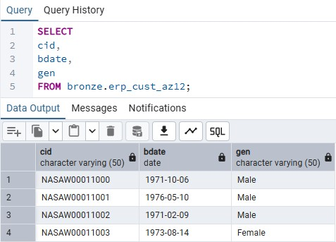

From the image it's noticeable that the "cid" column can be connected to the "cst_key" from crm_cust_info, however, each row contains 3 characters at the start that make it not match. So to address this, I'll start by taking them out, since they have no relation with any other table, using the following query:

```SQL
SELECT
cid,
CASE WHEN cid LIKE 'NAS%' THEN SUBSTRING(cid, 4, LENGTH(cid))
    ELSE cid
END AS cid,
bday,
gen
FROM bronze.erp_cust_az12;
```

2. Validity of the Dates

To check the validity of the dates in the "bdate" column, I'll make a query that finds if the date is in the future:

```SQL
SELECT DISTINCT 
bdate
FROM bronze.erp_cust_az12
WHERE bdate > GETDATE();
```

And there are cases where the limit is broken, which means that there's a data quality issue:

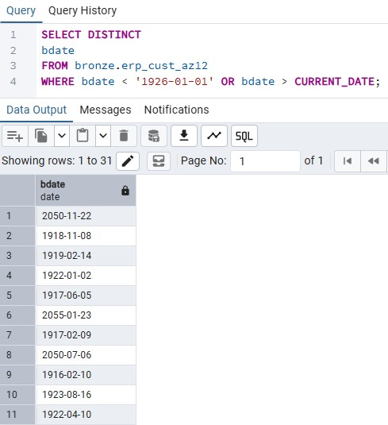

So to adress this, I'll turn these values into NULL, and keep on building the table query:

```SQL
SELECT

CASE WHEN cid LIKE 'NAS%' THEN SUBSTRING(cid, 4, LENGTH(cid))
    ELSE cid
END AS cid,

CASE WHEN bdate > CURRENT_DATE THEN NULL
    ELSE bdate
END AS bdate,

gen
FROM bronze.erp_cust_az12;
```

3. Checking validity of gen column

```SQL
SELECT DISTINCT gen
FROM bronze.erp_cust_az12;
```

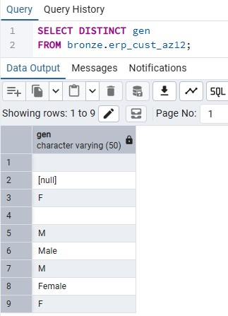

There are multiple value when it was supposed to be only 3, Male, Female or n/a. To address this:

```SQL
SELECT
CASE WHEN cid LIKE 'NAS%' THEN SUBSTRING(cid, 4, LENGTH(cid))
    ELSE cid
END AS cid,

CASE WHEN bdate > CURRENT_DATE THEN NULL
    ELSE bdate
END AS bdate,

CASE WHEN UPPER(TRIM(gen)) IN('F', 'FEMALE') THEN 'Female'
    WHEN UPPER(TRIM(gen)) IN ('M', 'MALE') THEN 'Male'
    ELSE 'n/a'
END AS gen

FROM bronze.erp_cust_az12;
```

So now, the only thing left to do is insert this query onto the silver table:

```SQL
INSERT INTO silver.erp_cust_az12(
	cid,
	bdate,
	gen
)
SELECT
CASE WHEN cid LIKE 'NAS%' THEN SUBSTRING(cid, 4, LENGTH(cid))
    ELSE cid
END AS cid,

CASE WHEN bdate > CURRENT_DATE THEN NULL
    ELSE bdate
END AS bdate,

CASE WHEN UPPER(TRIM(gen)) IN('F', 'FEMALE') THEN 'Female'
    WHEN UPPER(TRIM(gen)) IN ('M', 'MALE') THEN 'Male'
    ELSE 'n/a'
END AS gen

FROM bronze.erp_cust_az12;
```

### **erp_loc_a101**

1. Checking the "cid" column

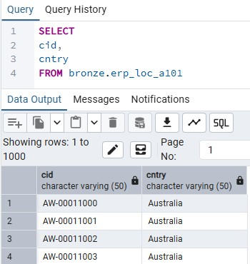

On this table, the id has a '-' in the middle which makes it not connect properly with the "cst_key" from the crm_cust_info table, So I'll just remove if with the following query:

```SQL
SELECT
REPLACE(cid, '-', '') cid,
cntry
FROM bronze.erp_loc_a101;
```

2. Checking consistency of the "cntry"

Starting by seeing all the possible values on this column:

```SQL
SELECT DISTINCT cntry
FROM bronze.erp_loc_a101
ORDER BY cntry;
```

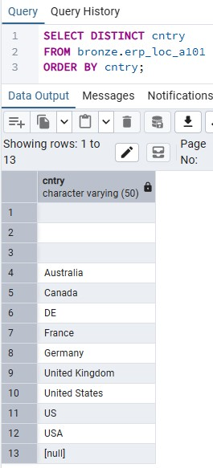

From this result, It's noticeable some inconsistencies. Countries are mentioned as both the full name, abreviations or there are empty spaces.
To address these I'll build on the previous query:

```SQL
SELECT
REPLACE(cid, '-', '') cid,

CASE WHEN TRIM(cntry) = 'DE' THEN 'Germany'
    WHEN TRIM(cntry) IN ('US', 'USA') THEN 'United States'
    WHEN TRIM(cntry) = '' OR cntry IS NULL THEN 'n/a'
    ELSE TRIM(cntry)
END AS cntry

FROM bronze.erp_loc_a101;
```

So now I just need to insert it into the corresponding silver table


```SQL
INSERT INTO silver.erp_loc_a101(
    cid,
    cntry
)
SELECT
REPLACE(cid, '-', '') cid,

CASE WHEN TRIM(cntry) = 'DE' THEN 'Germany'
    WHEN TRIM(cntry) IN ('US', 'USA') THEN 'United States'
    WHEN TRIM(cntry) = '' OR cntry IS NULL THEN 'n/a'
    ELSE TRIM(cntry)
END AS cntry

FROM bronze.erp_loc_a101;
```

### **erp_px_cat_g1v2**

1. Checking the "id" column

This ID is ready to be connected to the "cat_id" column from crm_prd_info created previously, so no changes are needed

2. Unwanted spaces in "cat", "subcat" and "maintenance"

```SQL
Select * FROM bronze.erp_px_cat_g1v2
WHERE cat != TRIM(cat) OR subcat != TRIM(subcat) OR maintenance != TRIM(maintenance);
```

By using this query, I can see if there are any unwanted spaces in all these columns, and the result is empty, so no transformations are needed.

3. Checking data quality of the columns

```SQL
SELECT DISTINCT(
    id,
    cat,
    subcat,
    maintenance
)
FROM bronze.erp_px_cat_g1v2;
```

And the result shows no anomalies, so no transformations are needed.´

So only inserting onto the table remains. For this I'll query:

```SQL
INSERT INTO silver.erp_px_cat_g1v2(
    "id",
    cat,
    subcat,
    maintenance
)
SELECT 
    "id",
    cat,
    subcat,
    maintenance
FROM bronze.erp_px_cat_g1v2;
```

### Creating the Stored Procedure
Now that all the information is gathered, I'll finally create the procedure for the silver layer with the following query:

```SQL
CREATE OR REPLACE PROCEDURE silver.load_silver()
LANGUAGE plpgsql
AS $$
DECLARE
    start_time TIMESTAMP;
    end_time TIMESTAMP;
    batch_start_time TIMESTAMP;
    batch_end_time TIMESTAMP;
BEGIN
    -- Batch start time
    batch_start_time := NOW();
    RAISE NOTICE 'Loading Silver Layer';

    -- Loading CRM Tables
    RAISE NOTICE '------------------------------------------------';
    RAISE NOTICE 'Loading CRM Tables';
    RAISE NOTICE '------------------------------------------------';

    -- Load crm_cust_info
    start_time := NOW();
    RAISE NOTICE '>> Truncating Table: silver.crm_cust_info';
    TRUNCATE TABLE silver.crm_cust_info;
    RAISE NOTICE '>> Inserting Data Into: silver.crm_cust_info';
	INSERT INTO silver.crm_cust_info (
    cst_id,
    cst_key,
    cst_firstname,
    cst_lastname,
    cst_marital_status,
    cst_gndr,
    cst_create_date
    )
	SELECT 
	    cst_id,
	    cst_key, 
	    TRIM(cst_firstname) AS cst_firstname, 
	    TRIM(cst_lastname) AS cst_lastname,
	    CASE 
	        WHEN cst_marital_status = 'S' THEN 'Single'
	        WHEN cst_marital_status = 'M' THEN 'Married'
	        ELSE 'n/a'
	    END AS cst_marital_status,
	    CASE 
	        WHEN cst_gndr = 'F' THEN 'Female'
	        WHEN cst_gndr = 'M' THEN 'Male'
	        ELSE 'n/a'
	    END AS cst_gndr,
	    cst_create_date
	FROM (
	    SELECT *, ROW_NUMBER() OVER (PARTITION BY cst_id ORDER BY cst_create_date DESC) AS flag_last
	    FROM bronze.crm_cust_info
	    WHERE cst_id IS NOT NULL)
	WHERE flag_last = 1;
    end_time := NOW();
    RAISE NOTICE '>> Load Duration: % seconds', EXTRACT(EPOCH FROM (end_time - start_time));
    RAISE NOTICE '>> -------------';

    -- Load crm_prd_info
    start_time := NOW();
    RAISE NOTICE '>> Truncating Table: silver.crm_prd_info';
    TRUNCATE TABLE silver.crm_prd_info;
    RAISE NOTICE '>> Inserting Data Into: silver.crm_prd_info';
	INSERT INTO silver.crm_prd_info(
	prd_id,
	cat_id,
	prd_key,
	prd_nm,
	prd_cost,
	prd_line,
	prd_start_dt,
	prd_end_dt
	)
	SELECT
	prd_id, 
	REPLACE(SUBSTRING(prd_key FROM 1 FOR 5), '-', '_') AS cat_id,
	SUBSTRING(prd_key, 7, LENGTH(prd_key)) AS prd_key,
	prd_nm,
	COALESCE(prd_cost, 0) AS prd_cost,
	CASE WHEN TRIM(prd_line) = 'M' THEN 'Mountain'
		WHEN TRIM(prd_line) = 'R' THEN 'Road'
		WHEN TRIM(prd_line) = 'S' THEN 'other Sales'
		WHEN TRIM(prd_line) = 'T' THEN 'Touring'
		ELSE 'n/a'
		END AS prd_line,
	CAST (prd_start_dt AS DATE) AS prd_start_dt,
	CAST (LEAD(prd_start_dt) OVER (PARTITION BY prd_key ORDER BY prd_start_dt)-INTERVAL '1 day' AS DATE) AS prd_end_dt
	FROM bronze.crm_prd_info;
    end_time := NOW();
    RAISE NOTICE '>> Load Duration: % seconds', EXTRACT(EPOCH FROM (end_time - start_time));
    RAISE NOTICE '>> -------------';

    -- Load crm_sales_details
    start_time := NOW();
    RAISE NOTICE '>> Truncating Table: silver.crm_sales_details';
    TRUNCATE TABLE silver.crm_sales_details;
    RAISE NOTICE '>> Inserting Data Into: silver.crm_sales_details';
    INSERT INTO silver.crm_sales_details(
	sls_ord_num,
	sls_prd_key,
	sls_cust_id,
	sls_order_dt,
	sls_ship_dt,
	sls_due_dt,
	sls_sales,
	sls_quantity,
	sls_price
	)
	SELECT
	    sls_ord_num,
	    sls_prd_key,
	    sls_cust_id,
	    
	    CASE WHEN sls_order_dt = 0 OR LENGTH(CAST(sls_order_dt AS VARCHAR)) != 8 THEN NULL
	        ELSE TO_DATE(CAST(sls_order_dt AS VARCHAR), 'YYYYMMDD')
	    END AS sls_order_dt,
	    
	    CASE WHEN sls_ship_dt = 0 OR LENGTH(CAST(sls_ship_dt AS VARCHAR)) != 8 THEN NULL
	        ELSE TO_DATE(CAST(sls_ship_dt AS VARCHAR), 'YYYYMMDD')
	    END AS sls_ship_dt,
	    
	    CASE WHEN sls_due_dt = 0 OR LENGTH(CAST(sls_due_dt AS VARCHAR)) != 8 THEN NULL
	        ELSE TO_DATE(CAST(sls_due_dt AS VARCHAR), 'YYYYMMDD')
	    END AS sls_due_dt,
	
		CASE WHEN sls_sales IS NULL OR sls_sales <= 0 OR sls_sales != sls_quantity * ABS(sls_price)
	        THEN sls_quantity * ABS(sls_price)
	        ELSE sls_sales
	    END AS sls_sales,
		
	    sls_quantity,
	    CASE WHEN sls_price IS NULL OR sls_price <= 0
			THEN sls_sales / NULLIF(sls_quantity, 0)
		ELSE sls_price
		END AS sls_price
		
	FROM bronze.crm_sales_details;
    end_time := NOW();
    RAISE NOTICE '>> Load Duration: % seconds', EXTRACT(EPOCH FROM (end_time - start_time));
    RAISE NOTICE '>> -------------';

    -- Loading ERP Tables
    RAISE NOTICE '------------------------------------------------';
    RAISE NOTICE 'Loading ERP Tables';
    RAISE NOTICE '------------------------------------------------';

    -- Load erp_loc_a101
    start_time := NOW();
    RAISE NOTICE '>> Truncating Table: silver.erp_loc_a101';
    TRUNCATE TABLE silver.erp_loc_a101;
    RAISE NOTICE '>> Inserting Data Into: silver.erp_loc_a101';
    INSERT INTO silver.erp_loc_a101(
    cid,
    cntry
	)
	SELECT
	REPLACE(cid, '-', '') cid,
	
	CASE WHEN TRIM(cntry) = 'DE' THEN 'Germany'
	    WHEN TRIM(cntry) IN ('US', 'USA') THEN 'United States'
	    WHEN TRIM(cntry) = '' OR cntry IS NULL THEN 'n/a'
	    ELSE TRIM(cntry)
	END AS cntry
	
	FROM bronze.erp_loc_a101;
    end_time := NOW();
    RAISE NOTICE '>> Load Duration: % seconds', EXTRACT(EPOCH FROM (end_time - start_time));
    RAISE NOTICE '>> -------------';

    -- Load erp_cust_az12
    start_time := NOW();
    RAISE NOTICE '>> Truncating Table: silver.erp_cust_az12';
    TRUNCATE TABLE silver.erp_cust_az12;
    RAISE NOTICE '>> Inserting Data Into: silver.erp_cust_az12';
    INSERT INTO silver.erp_cust_az12(
	cid,
	bdate,
	gen
	)
	SELECT
	CASE WHEN cid LIKE 'NAS%' THEN SUBSTRING(cid, 4, LENGTH(cid))
	    ELSE cid
	END AS cid,
	
	CASE WHEN bdate > CURRENT_DATE THEN NULL
	    ELSE bdate
	END AS bdate,
	
	CASE WHEN UPPER(TRIM(gen)) IN('F', 'FEMALE') THEN 'Female'
	    WHEN UPPER(TRIM(gen)) IN ('M', 'MALE') THEN 'Male'
	    ELSE 'n/a'
	END AS gen
	
	FROM bronze.erp_cust_az12;
    end_time := NOW();
    RAISE NOTICE '>> Load Duration: % seconds', EXTRACT(EPOCH FROM (end_time - start_time));
    RAISE NOTICE '>> -------------';

    -- Load erp_px_cat_g1v2
    start_time := NOW();
    RAISE NOTICE '>> Truncating Table: silver.erp_px_cat_g1v2';
    TRUNCATE TABLE silver.erp_px_cat_g1v2;
    RAISE NOTICE '>> Inserting Data Into: silver.erp_px_cat_g1v2';
    INSERT INTO silver.erp_px_cat_g1v2(
    "id",
    cat,
    subcat,
    maintenance
	)
	SELECT 
	    "id",
	    cat,
	    subcat,
	    maintenance
	FROM bronze.erp_px_cat_g1v2;
    end_time := NOW();
    RAISE NOTICE '>> Load Duration: % seconds', EXTRACT(EPOCH FROM (end_time - start_time));
    RAISE NOTICE '>> -------------';

    -- Batch end time
    batch_end_time := NOW();
    RAISE NOTICE '==========================================';
    RAISE NOTICE 'Loading Silver Layer Completed';
	RAISE NOTICE '>> Load Duration: % hours % minutes % seconds',
	EXTRACT(HOUR FROM (batch_end_time - batch_start_time)),
	EXTRACT(MINUTE FROM (batch_end_time - batch_start_time)),
	EXTRACT(SECOND FROM (batch_end_time - batch_start_time));
    RAISE NOTICE '==========================================';
EXCEPTION
    WHEN OTHERS THEN
        RAISE NOTICE '==========================================';
        RAISE NOTICE 'ERROR OCCURRED DURING LOADING BRONZE LAYER';
        RAISE NOTICE 'Error Message: %', SQLERRM;
        RAISE NOTICE '==========================================';
END;
$$;
```

And this is how it looks like inside the PGAdmin:

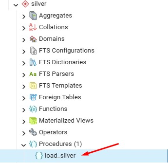